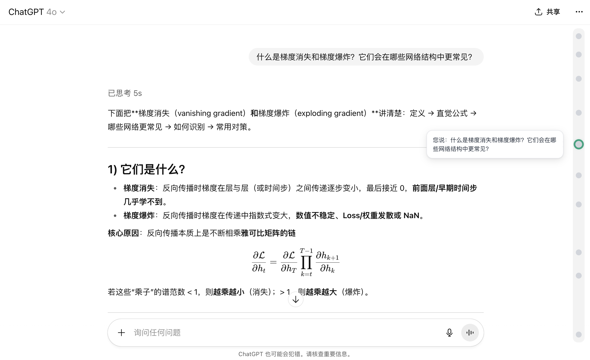

  

# 🕰 ChatGPT 对话时间轴插件

> 🇺🇸 English version available in [here](./README.md)

为 ChatGPT 网页版添加会话时间轴导航条，让你更轻松地查看整场对话结构，快速跳转任何一句话，提升效率与可控性。

---

## ✨ 插件功能特色

- 📍 每条用户消息生成可点击锚点  
- 🧭 支持一键跳转任意消息位置  
- ⭐ 支持长按标记重点内容，并在时间轴上高亮显示（标记将保存在浏览器的 localStorage 中，即使刷新也不会丢失）  
- 🌗 自适应 ChatGPT 的深色 / 浅色主题  

---

## 🧩 如何安装（适用于 Chrome / Edge 浏览器）

1. 下载本项目并找到 `extension/` 文件夹（包含 `manifest.json`, `content.js`, `styles.css`）
2. 打开浏览器，访问：`chrome://extensions/`
3. 右上角开启「开发者模式」
4. 点击「加载已解压的扩展程序」
5. 选择项目中的 `extension/` 文件夹进行加载

> 安装成功后，打开 ChatGPT 会话页面（例如 chat.openai.com/c/...），即可看到页面右侧出现对话时间轴。

## 🙏 致谢

本项目的灵感来源于 Google AI Studio 中优雅直观的对话时间线。  
我们希望将这种高效的时间轴式导航方式带到 ChatGPT 用户社区。

## 📄 开源协议

本项目采用 [MIT License](LICENSE) 协议。